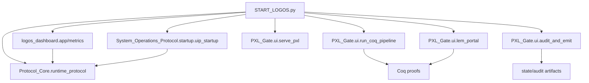

# Runtime Dependency Graph

## Textual dependency list

- `START_LOGOS.py`
	- imports `System_Stack.Logos_Protocol.Protocol_Core.runtime_protocol`
	- imports `PXL_Gate.ui.run_coq_pipeline`, `PXL_Gate.ui.lem_portal`, `PXL_Gate.ui.audit_and_emit`
	- imports `PXL_Gate.ui.serve_pxl`
	- imports `logos_dashboard.metrics`, `logos_dashboard.app`
	- imports `System_Operations_Protocol.startup.uip_startup`
- `runtime_protocol.py`
	- imports stdlib (`json`, `datetime`, `Path`)
	- writes to `state/alignment/runtime_protocol.jsonl`
- `PXL_Gate.ui.run_coq_pipeline`
	- drives Coq build pipeline under `PXL_Gate`
- `PXL_Gate.ui.lem_portal`
	- reads proof discharge state
- `PXL_Gate.ui.audit_and_emit`
	- rewrites audit artifacts
- `PXL_Gate.ui.serve_pxl`
	- exposes Flask endpoints for proof/UI interactions
- `logos_dashboard.app`
	- depends on `logos_dashboard.metrics`
	- updates telemetry status
- `System_Operations_Protocol.startup.uip_startup`
	- instantiates `UIPManager` consuming SCP/ARP modules under `System_Stack`

## Mermaid dependency diagram

